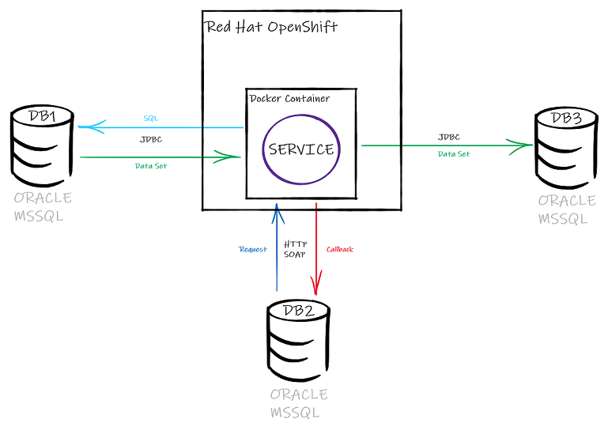

# Проектная работа

## Тема
Микросервис Data Transfer

## Идея
Появилась необходимость в инструменте передачи данных между базами данных по запросу из третьей. 
Типы баз данных могут быть разными: Oracle, MS SQL, MySQL и т.д. 
Запрос для запуска передачи данных отправляется из одной из баз программно по протоколу SOAP и должен содержать,
как минимум, информацию о подключениях к базе источнику и базе назначения, описание структуры выборки данных, 
информацию об точке приема данных в базе назначения.

Инициатор запроса не должен ждать завершения передачи данных, 
но должна быть возможность проверки завершения передачи, так же по запросу. 

## Технологии
Spring framework

## Примерное тех. решение
* Микросервис будет развернут на контейнерной платформе Red Hat OpenShift.
* Сервис запускает веб сервер и ожидает входящих запросов
* При поступлении запроса на передачу данных, формируется и выполняется SQL запрос в базе источнике
* Каждое поле строки полученных данных передается в качестве входного параметра процедуры базы приемника и обрабатывается там
* После окончания передачи всех данных будет выполнена функция обратного вызова, переданная в запросе на передачу данных
* Информация о запущенных заданиях и их статус записывается в in-memory базу данных H2
* На запрос о статусе задания, информация будет получаться из H2 по id задания
* SOAP-сообщение на запуск задания будет содержать следующие сущности:
    * id задания
    * url подключения к базе данных источнику
    * url подключения к базе данных назначения
    * url подключения к базе данных для обратного вызова
    * имя таблицы из которой будет выборка
    * имя процедуры для обработки данных в базе назначения
    * имя функции обратного вызова
* Ответное SOAP-сообщение
    * код ошибки (0 - нет ошибки)
    * сообщение об ошибке
    * сообщение для комментария
* SOAP-сообщение на получение статуса задания
    * id задания
* Ответное SOAP-сообщение
    * id задания
    * код ошибки (0 - нет ошибки)
    * сообщение об ошибке
    * сообщение для комментария

## Примерный объем работ
1 - неделя
* Реализовать контроллеры для запросов на передачу данных и получения статуса задания
* Реализовать компонент, содержащий коннекты к базам данных
* Реализовать преобразование SOAP-сообщений из XML в объекты Java и обратно

2 - неделя
  
* Реализовать, класс, запускающий выполнение передачи данных в отдельном потоке
* Реализовать сущность "Задание", сохранение ее в H2 и получение из H2
